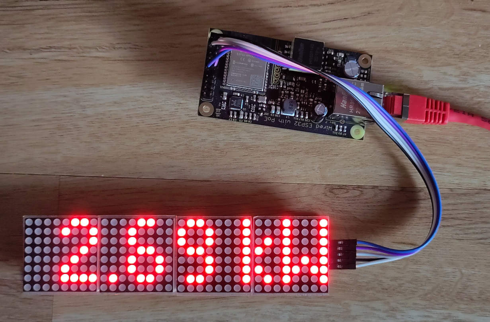

# PVview

An Ethernet only PV display - POE powered and using Modbus TCP to get data from the inverter.

# Features

- POE powered
- Modbus TCP
- Automatic prefixes (W, kW, MW, ...)
- Firmware over-the-air updates (/serverIndex)
- Display cycle between power and time (configurable)

# Components

- Board - [wESP32](https://wesp32.com/)
- Display - [MAX7219](https://www.az-delivery.de/collections/leds/products/4-x-64er-led-matrix-display)

# Dependencies

- Arduino IDE
- MD_MAX72XX
- MD_Parola
- https://github.com/espressif/arduino-esp32

# ToDo

- Toggle between power and energy
- Sleep at night (the ESP32...)
- Support multiple lines
- Web interface
