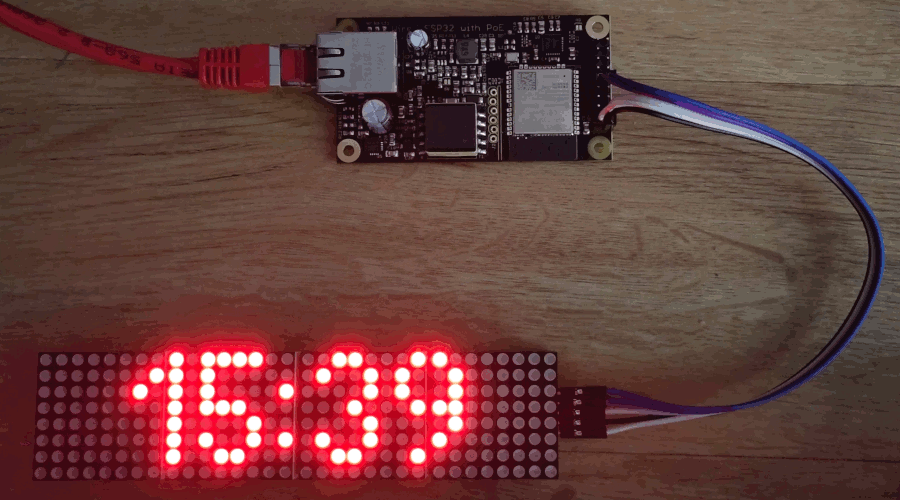

# PVview

An Ethernet only PV display - POE powered and using Modbus TCP to get data from the inverter.

# Features

- POE powered
- Modbus TCP
- Automatic prefixes (W, kW, MW, ...)
- Display cycle between power, energy and time (configurable)
- Read multiple inverters and sum values
- Firmware over-the-air updates (/serverIndex)
- Debug with telnet

## Supported devices

- Modbus TCP inverter
  - Fronius Symo
  - Sungrow
  - Sunny WebBox
- Modbus RTU electric meter (over Modbus TCP gateway)
  - ABB B23 212-100
  - Eastron SDM630
  - Finder 7E.78.8.400.0212
  - Finder 7M.38.8.400.0212
  - PHOENIX CONTACT EEM-350-D-MCB
  - WAGO 879-30x0

# Components

- Board - [wESP32](https://wesp32.com/)
- Display - [MAX7219](https://www.az-delivery.de/collections/leds/products/4-x-64er-led-matrix-display)

# Dependencies

- Arduino IDE
- MD_MAX72XX by majicDesigns
- MD_Parola by majicDesigns
- RemoteDebug by Joao Lopes
- https://github.com/espressif/arduino-esp32

# ToDo

- Sleep at night (the ESP32...)
- Support multiple lines
- Web interface
